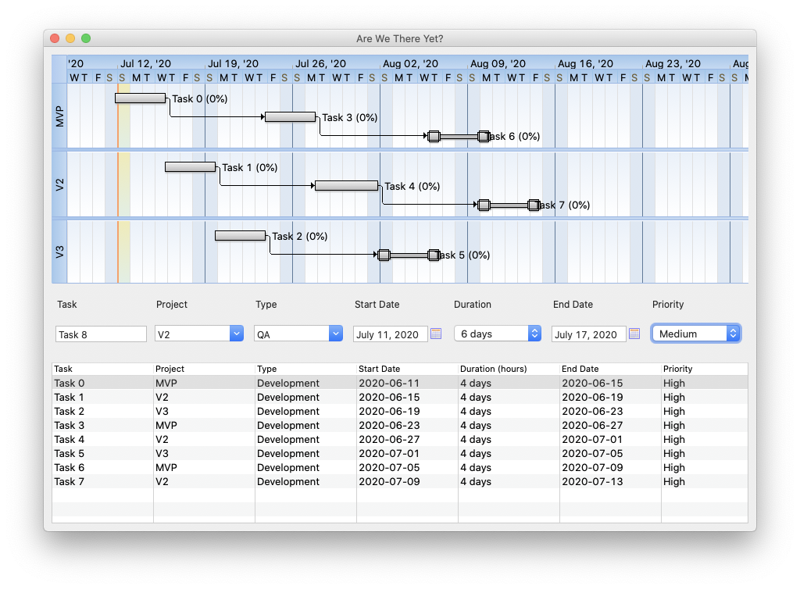
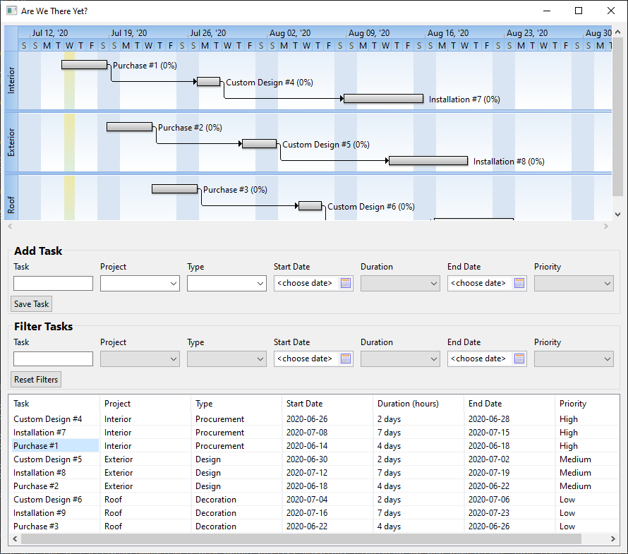

#  Are We There Yet? (Version 1.0.0)
## A tool that helps you learn when your small projects will finish

Simply enter tasks and see them reflected in the project progress Gantt Chart.

Mac Screenshot:

Windows Screenshot:

[ Download Are We There Yet? v1.0.0](https://www.dropbox.com/s/p6txqnpwc3trh8f/Are%20We%20There%20Yet-1.0.0.dmg?dl=1)

**Note**: this project is still work in progress. 

### Initial Plan

“Plans are nothing; planning is everything” - Former US President Dwight D Eisenhower

[INITIAL_PLAN.md](INITIAL_PLAN.md)

### Releases

Development may be tracked in [GitHub Projects](https://github.com/AndyObtiva/are-we-there-yet/projects/1).

Planned Releases:
- [v0.5.0 (Alpha)](https://github.com/AndyObtiva/are-we-there-yet/projects/1?card_filter_query=milestone%3A%22v0.5.0+%28Alpha%29%22) on 2020-07-12 ([Download Here](https://www.dropbox.com/s/g8m3dg5xrcpfzs6/Are%20We%20There%20Yet-0.5.0.dmg?dl=1))
- [v0.6.0 (Alpha)](https://github.com/AndyObtiva/are-we-there-yet/projects/1?card_filter_query=milestone%3A%22v0.6.0+%28Alpha%29%22) on 2020-07-13 ([Download Here](https://www.dropbox.com/s/8wl8fhtz5sma3jk/Are%20We%20There%20Yet-0.6.0.dmg?dl=1))
- [v0.7.0 (Alpha)](https://github.com/AndyObtiva/are-we-there-yet/projects/1?card_filter_query=milestone%3A%22v0.7.0+%28Alpha%29%22) on 2020-07-15 ([Download Here](https://www.dropbox.com/s/a8pl4a7c6d8prkq/Are%20We%20There%20Yet-0.7.0.dmg?dl=1))
- [v1.0.0 (MVP)](https://github.com/AndyObtiva/are-we-there-yet/projects/1?card_filter_query=milestone%3A%22v1.0.0+%28MVP%29%22) on 2020-07-19 ([Download Here](https://www.dropbox.com/s/p6txqnpwc3trh8f/Are%20We%20There%20Yet-1.0.0.dmg?dl=1))
- [v1.1.0 (Windows)](https://github.com/AndyObtiva/are-we-there-yet/projects/1?card_filter_query=milestone%3A%22v1.1.0+%28Windows%29%22) on 2020-07-31

### License

[MIT License](LICENSE.txt)

Copyright (c) 2020 - Are We There Yet? by [Andy Maleh](https://github.com/AndyObtiva)

--

Built with [Glimmer](https://github.com/AndyObtiva/glimmer) (Ruby Desktop Development GUI Library).

Are We There Yet? logo was made by <a href="https://www.flaticon.com/authors/freepik" title="Freepik">Freepik</a> from <a href="https://www.flaticon.com/" title="Flaticon"> www.flaticon.com</a>
